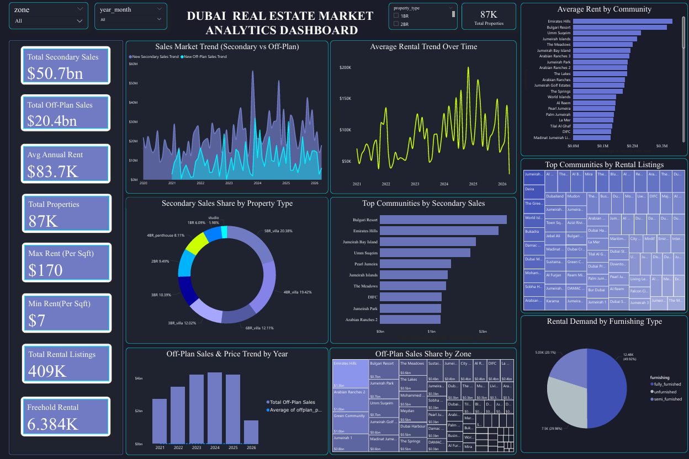

#  Dubai Real Estate Market Analytics Dashboard



##  Project Overview

This project presents an interactive **Dubai Real Estate Market Analytics Dashboard** built using **Power BI**.

The dashboard provides a comprehensive analysis of Dubai's real estate market from **2021 to 2026**, focusing on sales trends, rental market performance, property distribution, and community-level insights.

The main objective of this project is to transform raw real estate data into meaningful business insights through data cleaning, transformation, data modeling, and interactive visualization.

---

##  Dataset

**Dataset Source:** Kaggle

The dataset contains Dubai real estate information including:

- Property details
- Sales transactions
- Rental listings
- Communities
- Property types
- Furnishing categories
- Price and rental information

**Data Period Covered:** 2021 - 2026

---

#  Data Cleaning & Preparation

Data cleaning and transformation were performed using **Power Query in Power BI**.

The following steps were carried out:

- Removed unnecessary columns
- Corrected data formats and data types
- Removed duplicate records
- Handled missing/null values
- Standardized community and property categories
- Prepared and structured data for analysis

---

#  Dashboard Features

The dashboard includes multiple interactive visualizations covering:

##  Sales Analysis

- Secondary Sales vs Off-Plan Sales trends
- Total sales value analysis
- Year-wise sales performance
- Sales distribution by property type

##  Rental Market Analysis

- Average rental trend over time
- Average rent by community
- Rental demand analysis based on furnishing type

##  Property Insights

- Total property analysis
- Community-wise property distribution
- Top communities by sales and rental listings
- Property type comparison

---

#  Key Insights

- Analyzed **87K+ properties** across Dubai
- Evaluated **409K rental listings**
- Compared Secondary and Off-Plan market performance
- Identified sales growth patterns between 2021 and 2026
- Analyzed rental demand across furnished categories
- Identified top-performing communities based on sales and rental activity

---

#  Dashboard Preview


---

#  Tools & Technologies Used

- **Power BI Desktop**
- **Power Query**
- **DAX (Data Analysis Expressions)**
- **Data Cleaning**
- **Data Transformation**
- **Data Visualization**
- **Kaggle Dataset**

---

# 📁 Project Files

```text
Dubai-Real-Estate-PowerBI-Analytics/

│
├── datasets/
│   ├── area_prices_monthly.csv
│   ├── metro_stations.csv
│   ├── off_plan.csv
│   ├── rentals.csv
│   └── secondary_sales.csv
│
├── Dubai_Real_Estate_Analytics.pbix
│
├── Dubai_Real_Estate_Dashboard_Report.pdf
│
├── Dubai_Real_Estate_Dashboard.png
│
└── README.md

```
---

#  Author

**Asna Abdul Latheef**

Data Analytics Enthusiast  

**Skills:** Power BI | Excel | SQL | Data Visualization

---

##  Project Highlights

This project demonstrates the complete data analytics workflow:

Raw Dataset  
⬇️  
Data Cleaning & Transformation  
⬇️  
Data Modeling  
⬇️  
DAX Calculations  
⬇️  
Interactive Power BI Dashboard  
⬇️  
Business Insights


hbbb b
